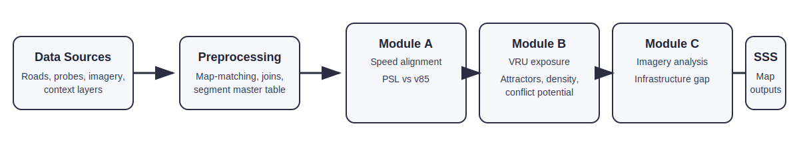

# RoadSense

RoadSense is an AI-powered road safety analytics platform that checks whether posted speed limits are genuinely protecting road users or simply numbers on a sign. It combines GPS probe data, road network geometry, street-level imagery, and contextual layers such as schools, markets, and population density to build a segment-by-segment view of risk and produce a transparent Speed Safety Score for policy action.

The score blends three signals: how far the posted limit deviates from observed operating speed, how exposed vulnerable road users are at that location, and what the physical road environment looks like on the ground. Each segment is classified into four risk tiers: Critical, High, Medium, and Low, with plain-language explanations designed for transport ministries and other non-technical decision-makers.

## Pipeline Overview



## Environment Setup

Reproducible environments are provided via `roadsense_environment.yml` (exported from the working `roadsense` micromamba environment).

### Prerequisites
- Linux, macOS, or Windows
- Micromamba or Conda

### Create Environment
Using Micromamba:

```bash
micromamba create -f roadsense_environment.yml
micromamba activate roadsense
```

Using Conda:

```bash
conda env create -f roadsense_environment.yml -n roadsense
conda activate roadsense
```

If you prefer pip/venv, you can still use `pip install -r requirements.txt` but the geospatial stack is easiest to install via conda/micromamba.

### Notes
- Python: 3.11
- NumPy: 1.25.2 (NumPy 2.x currently causes GeoPackage export issues with this geospatial stack)
- GeoPandas: 0.14.3
- GDAL: 3.9.3

The file `roadsense_environment.yml` is committed at the repository root for reproducible installs.

## Run

The recommended run order is:

```bash
python -m src.utils audit
python -m src.preprocessing
python -m src.module_a
python -m src.module_b
python -m src.module_c
python -m src.scoring --config config/scoring_weights.yaml
python -m src.evaluation
python -m src.visualise
```

The composite scoring entrypoint is:

```bash
python src/scoring.py --config config/scoring_weights.yaml
```

## Outputs

- `data/processed/segments_master.gpkg` - master segment table after preprocessing
- `outputs/all_segments_scored.gpkg` - full scored dataset
- `outputs/geojson/all_segments_scored.geojson` - web-friendly scored export
- `outputs/geojson/priority_segments_top100.geojson` - top-priority export for GIS tools
- `outputs/maps/roadsense_priority_map.html` - interactive review map
- `docs/evaluation_results.md` - evaluation summary and validation notes

## Methodology

RoadSense follows a five-stage pipeline: data ingestion, spatial preprocessing, three parallel analysis modules, composite scoring, and geospatial visualisation. Module A measures speed alignment against observed operating speed and Safe System reference speeds. Module B estimates vulnerable road user exposure using attractors, population density, conflict potential, land use, and powered two-wheeler context. Module C uses Mapillary detections or a CLIP fallback to estimate protective infrastructure coverage.

Those signals are normalised and combined into a single Speed Safety Score per segment. The scoring is intentionally transparent so the same inputs always produce the same outputs, and so the assumptions behind each step can be documented and reviewed. Evaluation includes internal consistency checks, spatial autocorrelation, benchmark validation, and sensitivity testing.

## Baseline Results

We evaluated two regression baselines for predicting `PercentOverLimit`:

- **Full feature set**: includes speed-derived proxy variables such as `MedianSpeed`, `F85thPercentileSpeed`, and `RankedPercentile`
- **Leakage-safe feature set**: restricted to more transferable variables such as `SpeedLimit`, `WeightedSample`, `SampleSize_avg`, `Shape_Length`, and `region`

### Key Finding

Random train/test splits produce overly optimistic performance due to spatial autocorrelation, because nearby road segments share similar structural and behavioural characteristics.

However, when evaluated under geographic holdout (training on one region and testing on another), performance degrades significantly. This indicates that the strongest predictors are proxy-heavy speed-derived variables that do not generalize across regions.

### Interpretation

- The full model serves as an upper-bound benchmark for in-region prediction.
- The leakage-safe model provides a more realistic and defensible baseline for cross-region evaluation.
- Geographic (spatial) validation is essential for assessing true generalization in road-safety modelling tasks.

### Results Summary

| Model | Split Type | MAE | RMSE | R² |
|---|---:|---:|---:|---:|
| Full Features | Random | 0.0296 | 0.0765 | 0.915 |
| Full Features | Thailand → Maharashtra | 0.1834 | 0.2776 | 0.202 |
| Full Features | Maharashtra → Thailand | 0.2032 | 0.2745 | -0.237 |
| Safe Features | Random | 0.1722 | 0.2231 | 0.277 |
| Safe Features | Thailand → Maharashtra | 0.3072 | 0.3775 | -0.477 |
| Safe Features | Maharashtra → Thailand | 0.2591 | 0.3115 | -0.593 |

## Data Sources and Citations

Add the exact citations for each project dataset here, including the ADB challenge data, road network source, GPS probe source, imagery source, and contextual layers such as schools, markets, and population density.

Suggested citation groups:
- ADB Challenges data package
- OpenStreetMap / OSMnx-derived road network layers
- Mapillary imagery and machine learning tags
- iRAP or WHO Safe System reference speeds
- Local census, land use, and point-of-interest datasets

- ADB AI for Safer Roads data guide: [docs/ADB_AI4SaferRoads_DataGuide.md](docs/ADB_AI4SaferRoads_DataGuide.md)

Run the ADB preprocessing pipeline (example):

```bash
python scripts/preprocess_adb.py --thailand /path/to/thailand_road_safety.gpkg \
	--maharashtra /path/to/maharashtra_road_safety.gpkg \
	--output outputs/processed_road_safety.gpkg
```

## Licence

MIT License. See [LICENSE](LICENSE).
